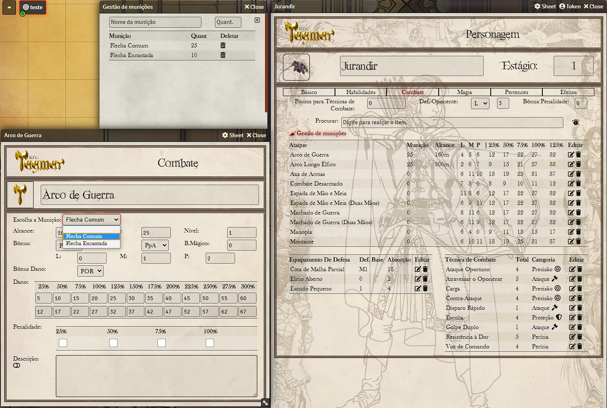

# Gestão de munições Tagmar

## Módulo para sistema Tagmar RPG no Foundry Vtt
### Esse módulo depende do sistema [Tagmar RPG](https://foundryvtt.com/packages/tagmar) para funcionar.
Gerencie vários tipos de munições, e várias armas usando a mesma munição. 
### Instalação
Copiar o link (https://raw.githubusercontent.com/marcoswalker/tagmar-ammu-nation/master/module.json) e colar na caixa manifest ao instalar módulo no Foundry Vtt. Depois é só ativar o módulo dentro do mundo.
### Instruções de uso
Clique em **Gestão de munições** dentro da aba Combate na ficha de Personagem, cadastre as munições, quando quiser repor a munição, digite o nome da munição existente e cadastre o novo valor. Na arma que for usar clique em editar, escolha a munição na lista. Todas as armas que tiverem a mesma munição, será subtraído quando um ataque usar essa munição.